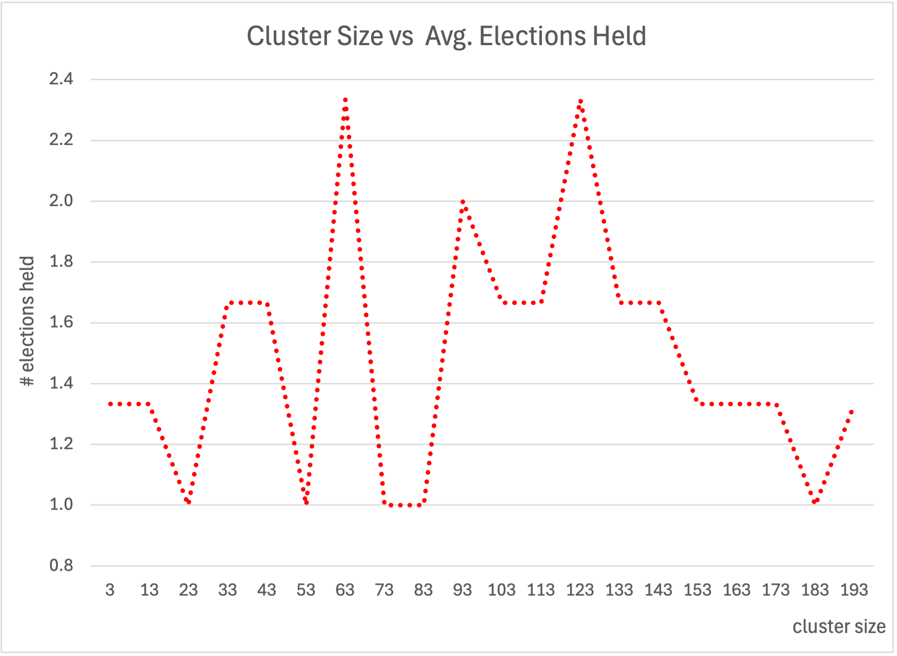
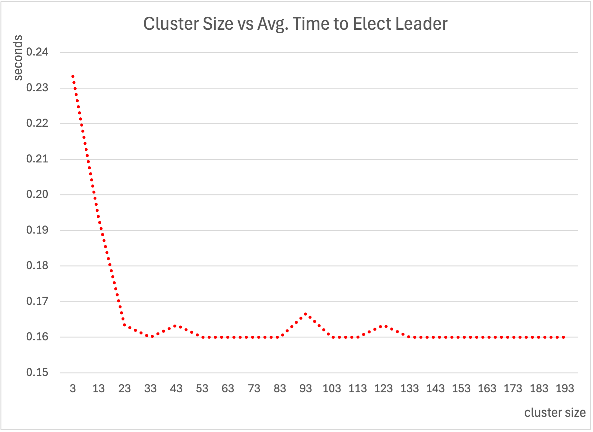
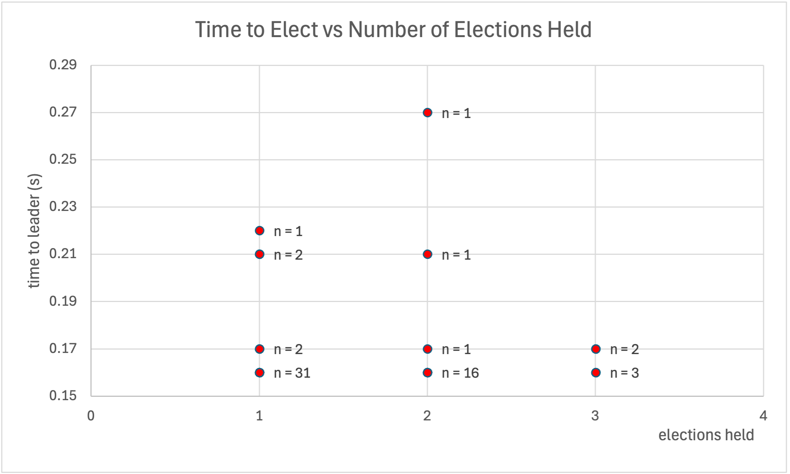

[](https://classroom.github.com/a/eGOtDXeS)
# Research Paper
* Name: Michaella Latkovic-Taber
* Semester: Spring 2025
* Topic: Leader Election in the Raft Consensus Algorithm: A Study in Fault-Tolerant Coordination.
* Link The Repository: https://github.com/Sp25-CS5008-Online-Stern/final-paper-mvlt18

## Introduction
Raft is a consensus algorithm developed by Diego Ongaro and John Ousterhout at Stanford University in 2014. Consensus algorithms are used to coordinate multiple computers to work as a coherent group which can survive the failure of some of its members. The primary goal in creating Raft was understandability. As such, Raft is easier to understand and simpler to implement method than previous consensus algorithms, namely Paxos. Because of this it has been implemented by popular distributed system tooling like etcd, consul, TiKV, and CockroachDB.

Raft solves the problem of achieving consensus for a replicated log across a group of machines (referred to as nodes), which can survive the loss or addition of members. To achieve this distributed consensus, Raft is comprised of three core functions: leader election, log replication, and safety. In this paper, we will explore an implementation of raft in python, focusing on leader election, which is the way by which Raft achieves an agreed upon state (consensus) across nodes. 

## Analysis of Algorithm

The algorithm consists of a series of smaller methods, each contributing to the overall goal of leader election. For the purposes of time and space complexity analysis, this implementation is broken down and evaluated by individual operations, followed by a separate summary to capture the overall algorithmic behavior in terms of best-case, average-case, and worst-case complexity. 


**Table 1: Time Complexity by Method**

| Operation                            | Code Location                    | Time Complexity | 
|-------------------------------------|----------------------------------|------------------|
| Election timeout trigger            | `election_timer()`               | $O(1)$             | 
| Candidate vote request broadcast    | `start_election()`               | $O(n)$             |
| Receive and process vote            | `receive_vote_request()` / `receive_vote()` | $O(1)$             | 
| Majority check                      | `check_if_won()`                 | $O(1)$             | 
| Leader transition                   | `become_leader()`                | $O(1)$             |
| Heartbeat broadcast (per interval) | `heartbeat()`                    | $O(n)$             | 

##### Constant-Time Operations: $O(1)$

The following methods execute in constant time, regardless of the number of nodes in the cluster:

- `election_timer()`
- `receive_vote_request()`
- `receive_vote()`
- `check_if_won()`
- `become_leader()`
  
These methods involve simple operations such as comparisons, assignments of variables, or increments. None of these methods iterate over the cluster or depend on its size. As such, their time complexity is $O(1)$.

##### Linear-Time Operations $(O(n))$

There are two methods that scale linearly with the number of nodes in the cluster:

1. Candidate Vote Request Broadcast (`start_election()`) - When a node becomes a candidate, it sends vote requests to all other nodes. This loop runs once for each of the other nodes, resulting in $O(n)$ time complexity.

```python
for node in self.cluster:
    if node.node_id != self.node_id:
        node.receive_vote_request(self.node_id, self.current_term)
```

2. Heartbeat Broadcast (`heartbeat()`) - The leader periodically sends heartbeats to all followers to maintain their leadership. Similar to the vote request broadcast, this loop also runs once per follower, leading to $O(n)$ time complexity.

```python   
for node in self.cluster:
    if node.node_id != self.node_id:
        node.reset_election_timeout()
```

**Table 2: Space Complexity**
| Data Stored                         | Location                         | Space Complexity | 
|-------------------------------------|----------------------------------|------------------|
| Per-node cluster reference          | `self.cluster`                   | $O(n)$             |
| Total cluster memory usage          | —                                | $O(n²)$            | 
| Other local state (term, vote, etc) | Node instance variables          | $O(1)$             | 

**Per-node cluster reference (self.cluster) – $O(n)$:**
Each node maintains a list of all nodes in the cluster to help with communication during leader elections. For a cluster of size $n$, this list contains $n$ references, which results in a space complexity of $O(n)$ per node.

**Total cluster memory usage – $O(n²)$:**
Since each of the $n$ nodes holds a list of $n$ references, the total number of references across the entire cluster is $n × n = n²$. This results in an overall space complexity of $O(n²)$.

**Other local state (term, vote, etc.) – $O(1)$:**
Each node stores variables such as current_term, voted_for, and votes_received. These are basic data types and do not scale with the number of nodes, resulting in a constant space complexity of $O(1)$ per node.

**Table 3: Leader Election Complexity**

| Scenario                  | Time Complexity | Space Complexity | 
|---------------------------|------------------|------------------|
| Best Case                 | $O(n)$             | $O(n²)$            | 
| Worst Case                | $O(kn)$            | $O(n²)$            | 
| Average Case              | $O(n)$         | $O(n²)$            | 

**Best Case:** In the best case scenario, one node's election timeout expires before all others, prompting it to become a candidate. It then receives votes from a majority of nodes and becomes the leader without any contention. This process involves each node communicating with every other node once, resulting in a time complexity of $O(n)$. Each node maintains references to all other nodes, leading to a space complexity of $O(n^2)$ for the entire cluster.

**Average Case:** Typically, Raft's use of randomized election timeouts ensures that elections are resolved quickly. This randomness reduces the likelihood of split votes, maintaining a time complexity of $O(n)$ on average. The space complexity remains at $O(n^2)$ due to the full mesh of node references.

**Worst Case:**  If multiple nodes initiate elections simultaneously — due to synchronized timeouts for example — split votes can occur. Resolving this may require $k$ additional election rounds, with each round involving communication with all nodes, resulting in a time complexity of $O(kn)$. The space complexity remains at $O(n^2)$, as each node maintains references to all others.​

## Empirical Analysis
Raft clusters of various sizes from 3 to 193 nodes were instantiated three times at each scale point to gather sufficient data for an average observation. Scaling started with 3 nodes as Raft requires at least 3 simulated nodes to achieve consensus. In total, 60 clusters were instantiated and for each one the total time it took the cluster to elect a leader and how many elections were held to achieve a stable leader election was recorded.

### Elections Held
For each cluster size instantiated, the number of election cycles required to establish a stable leader was recorded. Leader stability is defined as the condition where no other node initiates a new election during the voting process. Initial expectations suggested that larger clusters might lead to more election cycles due to an increased likelihood of timeout overlaps among nodes. However, results show that the number of elections held is, on average, consistently distributed as cluster size increases. Across all simulations, a stable leader was established within a maximum of three election cycles, with no observable trend toward more or fewer election cycles at higher or lower node counts.

**Chart 1: Cluster size vs Average Election Held**


### Time To Elect
For each cluster instantiated, the time required to elect a stable leader was also measured. Smaller clusters containing fewer than 13 nodes had a higher average election time of approximately 0.23 seconds, whereas larger clusters with more than 13 nodes stabilized around 0.16 seconds. This result was unexpected, as smaller clusters did not experience a higher number of election cycles that might otherwise explain the increased election time.

**Chart 2: Cluster size vs Time to Elect Leader**


However, the results indicate that the number of election cycles is *not* the primary factor driving election time variance. Only a few data points show instances where two election cycles resulted in a higher overall election time, and in every case where three election cycles occurred, the cluster elected a leader rapidly. The chart below shows time to elect a stable leader plotted against the number of election cycles held, with `n` indicating how many cluster instantiations were observed at that data point.

**Chart 3: Time to Elect Leader vs Number of Elections Held**


The lower time to election in larger clusters is likely attributable to the increased number of nodes attempting to become leader. In Raft, the time to elect a leader is governed by randomized election timeouts, configured in this simulation between 150 and 300 milliseconds (0.15–0.30 seconds). With fewer nodes, it is more likely that all timeout values fall near the midpoint of this range (e.g., approximately 225 milliseconds), resulting in a higher average election time. As cluster size increases, the probability rises that at least one node will select a timeout near the lower bound (150 milliseconds), initiating an election earlier. The empirical data reflects this effect, with election times stabilizing around 160 milliseconds as seen in Chart 2, closely matching the expected behavior based on the configured timeout range. Thus, the faster leader elections observed in larger clusters are explained by the greater likelihood of early timeout selection, rather than by reduced instability.

### Bias and limitations
This simulation represents an idealized environment, modeling a distributed system using Python threading to simulate node behavior. All nodes operated within a single process on a local machine, without distribution across separate nodes or isolated processes. As a result, the simulation assumes instantaneous communication, no network delays, and perfectly reliable nodes. In a real-world implementation of Raft, such factors would introduce additional variance and could increase both the number of election cycles and the time required to elect a leader. Consequently, the results presented here are representative of the best-case performance of Raft leader election under ideal conditions.

## Application

Raft is used to help build reliable distributed systems which need to survive data or state loss across members and where the amount of data which needs to be shared is relatively small. This means that the best applications of Raft are to build a distributed state machine which often serves as the control plane for a larger system. Versions of Raft are used by several modern database systems such as CockroachDB [13], MongoDB [14], and Neo4j [15]. 

In practice, the most famous use of Raft is within etcd[16], a distributed reliable key-value store which serves as a backing data source for distributed systems. etcd is a critical dependency of Kubernetes [17], which uses etcd as its data store for all cluster data, particularly to ensure a consistent agreed upon state of the Kubernetes cluster.


*Original image credited to xkcd.com/2347, alterations by Josh Berkus.*

Kubernetes (and thus etcd using Raft) has been widely adopted by industry and government, with the Cloud Native Computing Foundation (CNCF) survey reporting in 2022 that more than 5.6 million developers used Kubernetes worldwide [18]. Notable examples of Kubernetes in use include Spotify [20], AirBNB [21], CERN [22], NASA JPL [23], the US Air Force (experimental used to run flight systems on an F16) [24], and OpenAI  who used Kubernetes to train ChatGPT [25]. Because of etcd and Kubernetes, Raft is now a foundational piece of modern IT infrastructure used to run critical systems and build new technologies like AI. 


## Implementation

#### Simplified Overview of Raft Algorithm

 Raft algorithm breaks down the problem of consensus into three sub-problems:
 1. Leader Election 
 2. Log Replication 
 3. Safety and Term Consistency

This implementation of Raft focuses on the **Leader Election** subproblem. This is the mechanism by which the nodes in the cluster decide on a single leader to coordinate operations. In raft, a node can be in one of three states: Leader, Follower, Candidate.

Raft is designed to run as a distributed system where each node typically run on a separate machine and communicates with other nodes via a network. Thus, the first challenge was to implement a simulated distributed system in a single Python program.  

To solve for this, the simulation uses Python's built in `threading` module [1] which allows multiple separate parts of the program (our simulated Raft nodes) to run concurrently. Each node runs in its own thread, which allows the node to independently track the timeout, start elections, and process votes. It's important to note that Python threads are subject to the Global Interpreter Lock (GIL) - which means that Python will only run one thread at a time, so our system is not truly running in parallel. However, for the purposes of this simulation, it is not a major concern and still an acceptable choice. This is because the simulation is timing driven and I/O- bound rather than CPU-intensive. As such the threading module can still simulate asynchronous behavior of a distributed system with real world behavior. 

Another thing to note is that multiple nodes can become candidates simultaneously, which would lead to a split-vote scenario where no candidate receives a majority vote to win. This is an expected outcome in Raft, to mitigate this, the algorithm uses randomized election timeouts. This makes it more likely that a follower will time-out before the others and successfully start an uncontested election. If a split vote does occur, each candidate simply times out again and starts a new election with a new random timeout, which will eventually result in a leader being elected.

To break down the leader election process further, these are the key steps followed (discussed in more detail below):

1. All nodes start as followers.
2. If a follower does not hear from a leader within a randomized timeout (150–300ms), it becomes a candidate and starts an election.
3. A candidate will increment its term, vote for itself, and request votes from other nodes.
4. Peers grant their vote if a candidate's term is more recent and if they haven't voted yet in the current term.
5. If majority is reached, the candidate becomes the leader.
6. Leader sends heartbeats to maintain authority. The simplest way to model this is each heartbeat resets followers election timeouts.
7. If a follower doesn't receive  a heartbeat before their election timeout ends, they start a new election.

We will dive deeper into each part of the process and its implementation below.

#### Language and Libraries Used
Language: Python 3.12
Libraries:
- `threading` – Used for simulating concurrent behavior of nodes in the cluster.
- `time` – Used for simulating delays, timeouts, and tracking simulation timing.
- `random` – Used to introduce randomized election timeouts.
- `csv` – Used for saving the simulation output data. 

#### Code Review

##### A. Configuration ([config.py](config.py))

The config file defines the parameters of the cluster and how it is tested. 

```python
TIMEOUT_RANGE = (.15, .30)
```
 `TIMOUT_RANGE` defines the randomized timeout interval  in seconds used to determine when a follow should start an election. Many of the examples I used as a guide for this implementation including the the original paper by Diego Ongaro and John Outsterhout lists the range timeout to be 150-300 milliseconds, so this simulation follows that same range. 

```python
SIMULATION_TIMEOUT = 45 # seconds
```
The `SIMULATION_TIMEOUT` is a hard limit for how long the simulation is allowed to run before timing out.

```python
CLUSTER_SIZES = range(3, 201, 10) 
```
The `CLUSTER_SIZES` is a range of 3 - 201 nodes going in steps of 10. 

##### B. Raft algorithm - Leader Election ([raft.py](raft.py))

The raft.py file contains a RaftNode class which is the behavior of a single node. Within this class are the following behaviors:
- timeouts and triggering elections
- requesting and giving votes
- counting votes and determining vote majority
- becoming a leader 
- sending and receiving heartbeats. 

###### Timeouts
Each node runs an election time in the background using threads. If the node does not receive a heartbeat before the timeout, then it will start an election. 

Inside the `election_timer()` method, there is a short pause `time.sleep(.05)`. This is to prevent "busy waiting"[2], where a thread continuously checks on a condition in a loop without resting. Python threads that busy-wait can become inefficient, using CPU resources unnecessarily. By introducing a shirt "sleep", this allows threads to pause between checks and improves the CPU usage. [2]

```python
    def generate_election_timeout(self):
        # get current time and add a random value within the timeout range
        return time.time() + random.uniform(*config.TIMEOUT_RANGE) 


    def election_timer(self):
        while not self.shared_cluster_flags['stop']: # while the simulation is running
            time.sleep(0.05) # sleep for .05 seconds to avoid 'busy waiting' 
            if self.state != 'Leader' and time.time() > self.election_timeout: # if not leader and timeout reached
                self.start_election() # start a new election!
```

###### Triggering An Election

When a node's timeout expires, it triggers the `start_election()` method to start a new election cycle. There a a series of updates that occur; the node transitions to a Candidate state, it increments it's term, and votes for itself. The node also resets it's election timeout and starts an internal counter to track number of times it initiated an election. After all of these updates, there is a simple for loop that requests votes to all other nodes. 

```python
    def start_election(self):
        self.state = 'Candidate' # change state to Candidate
        self.current_term += 1 # increment the current term
        self.votes_received = 1 # reset votes received to 1 (vote for self)
        self.voted_for = self.node_id # vote for self, indicating that this node has voted for itself
        self.election_timeout = self.generate_election_timeout() # reset the election timeout to a new random value
        self.election_count += 1 # increment the election count
        # send vote requests to all other nodes in the cluster
        for node in self.cluster:
            if node.node_id != self.node_id:
                node.receive_vote_request(self.node_id, self.current_term)
        self.check_if_won() # check if the node has won the election
```

###### Requesting Votes + Giving Votes

The  `recieve_vote_request()` method handles the incoming vote request from other nodes. In the full Raft implementation, this would include more complex checks such as verifying the log consistency in addition to comparing the terms. Specifically a nose will only grant it's vote if the candidates log is up to date as its own[5]. This restriction helps to ensure that a leader will always have most up to date complete log. 

In this simplified version, the node grants its vite only if the candidate's term is newer **and** if it hasn't cast a vote yet in the current term. If both are true, then it's current term is updated and it records it's vote for the candidate before calling  `receive_vote()` method which simply increments the number of votes received and then checks whether the node has won the election.
```python

    def receive_vote_request(self, candidate_id: int, term: int):
        if term > self.current_term and self.voted_for is None: # check if the term is greater and not voted yet
            self.voted_for = candidate_id # vote for the candidate
            self.current_term = term # update the current term (can only vote for one candidate per term)
            for node in self.cluster: # send vote back to the candidate
                if node.node_id == candidate_id: 
                    node.receive_vote() 
                    break
```

```python
 
    def receive_vote(self):
        self.votes_received += 1
        self.check_if_won()
```

###### Vote Count & Determining Vote Majority

The `check_if_won()` method calculates whether the node has won the election by checking if the number of votes received is greater than half the cluster size. 
```python
    def check_if_won(self):
        # majority is reached if votes received > half of the cluster size 
        if self.votes_received > len(self.cluster) // 2 and self.state == 'Candidate': # must also be a candidate
            self.become_leader() # become leader! Success. 
```

###### Becoming Leader

If a candidate receives majority of votes it becomes the Leader. The become_leader() method updates the node’s state and sets the shared flags to stop the simulation and record the time to leader election (which is later saved in output data). It also calls send_heartbeats() to begin the process of maintaining leadership.

In a full Raft implementation, this is the point where the leader would begin managing log replication, sending actual commands to be executed across the cluster. However, in this simplified implementation, the focus is solely on leader election. Once a leader is chosen and begins sending heartbeats, the implementation ends. 

```python

    def become_leader(self):
        self.state = 'Leader'  
        if not self.shared_cluster_flags['leader_elected']: 
            self.shared_cluster_flags['leader_elected'] = True
            self.shared_cluster_flags['time_to_leader'] = time.time() - self.shared_cluster_flags['start_time']
        self.send_heartbeats()  # Start a thread to send heartbeats to followers
```

###### Sending & Receiving Heartbeats. 

The heartbeats methods again utilize Python's threading module to simulate asynchronous behavior. When a node becomes a leader, it starts a background thread that will periodically send heartbeats to all other nodes. 

In this simplified implementation, heartbeats do not contain log entries or state data. They only reset the election timeouts for all followers, this prevents followers from timing out and starting a new election while the leader is active. The heartbeat interval is set to 100 milliseconds which is below the randomized election timeout range of 150–300ms. This ensures that followers receive heartbeats regularly enough to maintain leader stability.

```python

    def send_heartbeats(self):
        threading.Thread(target=self.heartbeat, daemon=True).start()

    def heartbeat(self):
        while self.state == 'Leader' and not self.shared_cluster_flags['stop']:
            for node in self.cluster:
                if node.node_id != self.node_id:
                    node.reset_election_timeout()
            time.sleep(.1)  # Heartbeat interval
```


##### C. Simulation Runner ([simulate.py](simulate.py))

The simulation file runs the experiment to generate data for leader election across a range of cluster sizes as defined in `config.py`. The output is saved in a CSV file ( [raft_simulation_results](raft_simulation_results.csv)) and is used in the [Empirical Analysis](#empirical-analysis) section above.


#### Summary & Learnings
Working through this algorithm was genuinely fun and I'm really glad I chose this opportunity to explore distributed consensus and the Raft algorithm. While each method in this implementation is relatively short and simple, the complexity was is in the state management and in making sure all parts occurred in the correct order. Visual resources were extremely helpful to get to a place where this order was clear. The interactive graphic from [The Secret LIves of Data](https://thesecretlivesofdata.com)[3] broke down the algorithm in simple intuitive steps. I also found Eli Bendersky's blog series to be invaluable -  which dived into the raft algorithm deeply and had a (more complex) implementation in Go[4] 


## References

[1]: https://docs.python.org/3/library/threading.html "Python Software Foundation. 'threading — Thread-Based Parallelism.' Python 3.12 Documentation."

[2]: https://superfastpython.com/thread-busy-waiting-in-python/ "SuperFastPython. 'Thread Busy Waiting in Python.'"

[3]: https://thesecretlivesofdata.com "The Secret Lives of Data. 'Raft: Understandable Distributed Consensus.'"

[4]: https://github.com/eliben/raft/blob/main/README.md "Bendersky, Eli. 'Raft: Understandable Distributed Consensus.' GitHub."

[5]: https://raft.github.io/raft.pdf "Ongaro, Diego, and John Ousterhout. 'In Search of an Understandable Consensus Algorithm.' Stanford University."

[6]: https://realpython.com/intro-to-python-threading/#working-with-many-threads "Real Python. 'Intro to Python Threading.'"

[7]: https://stackoverflow.com/questions/481970/how-many-threads-is-too-many "Stack Overflow. 'How Many Threads Is Too Many?'"

[8]: https://stackoverflow.com/questions/17499837/python-time-sleep-vs-busy-wait-accuracy "Stack Overflow. 'Python: time.sleep vs Busy Wait Accuracy.'"

[9]: https://codemia.io/knowledge-hub/path/raft_leader_election_algorithm_one_vote_for_term "Codemia. 'Raft Leader Election Algorithm: One Vote per Term.'"

[10]: https://www.brianstorti.com/raft/ "Storti, Brian. 'Raft Explained.' brianstorti.com."

[11]: https://liangrunda.com/posts/raft-lite/ "Liang, Runda. 'Raft Lite.' liangrunda.com."

[12]: https://arorashu.github.io/posts/raft.html "Arora, Shubham. 'Raft Algorithm Simplified.' arorashu.github.io."

[13]: https://www.cockroachlabs.com/docs/v25.1/architecture/life-of-a-distributed-transaction.html#raft-leader "Cockroach Labs. 'Life of a Distributed Transaction.' CockroachDB Documentation."

[14]: https://www.usenix.org/conference/nsdi21/presentation/zhou "Zhou, Wenting, et al. 'Fault-Tolerant Replication in MongoDB.' USENIX NSDI 2021."

[15]: https://neo4j.com/docs/operations-manual/current/clustering/setup/routing/ "Neo4j. 'Routing Requests in Clusters.' Neo4j Operations Manual."

[16]: https://github.com/etcd-io/etcd "etcd. 'etcd GitHub Repository.'"

[17]: https://kubernetes.io/docs/tasks/administer-cluster/configure-upgrade-etcd/ "Kubernetes. 'Configure and Upgrade etcd Cluster.'"

[18]: https://www.cncf.io/announcements/2022/02/10/cncf-sees-record-kubernetes-and-container-adoption-in-2021-cloud-native-survey/ "Cloud Native Computing Foundation. 'CNCF Sees Record Kubernetes and Container Adoption in 2021.'"

[19]: https://www.cncf.io/reports/cncf-annual-survey-2023/ "Cloud Native Computing Foundation. 'CNCF Annual Survey 2023.'"

[20]: https://kubernetes.io/case-studies/spotify/ "Kubernetes. 'Case Study: Spotify.'"

[21]: https://medium.com/airbnb-engineering/dynamic-kubernetes-cluster-scaling-at-airbnb-d79ae3afa132 "Airbnb Engineering. 'Dynamic Kubernetes Cluster Scaling at Airbnb.' Medium."

[22]: https://kubernetes.io/case-studies/cern/ "Kubernetes. 'Case Study: CERN.'"

[23]: https://smce.nasa.gov/overview/ "NASA JPL. 'Overview of Software Engineering and Model Checking.'"

[24]: https://www.youtube.com/watch?v=YjZ4AZ7hRM0 "Rancher Labs. 'Using Kubernetes in the Cockpit of an F-16.' YouTube."

[25]: https://openai.com/index/scaling-kubernetes-to-7500-nodes/ "OpenAI. 'Scaling Kubernetes to 7,500 Nodes.'"

[1] Python Software Foundation. threading — Thread-Based Parallelism. Python 3.12 Documentation. https://docs.python.org/3/library/threading.html.

[2] SuperFastPython. Thread Busy Waiting in Python. https://superfastpython.com/thread-busy-waiting-in-python/.

[3] The Secret Lives of Data: Raft. https://thesecretlivesofdata.com.

[4] Bendersky, Eli. Raft: Understandable Distributed Consensus. GitHub. https://github.com/eliben/raft/blob/main/README.md.

[5] Ongaro, Diego, and John Ousterhout. “In Search of an Understandable Consensus Algorithm.” Stanford University. https://raft.github.io/raft.pdf.

[6] Real Python. Intro to Python Threading. https://realpython.com/intro-to-python-threading/#working-with-many-threads.

[7] Stack Overflow. “How Many Threads Is Too Many?” https://stackoverflow.com/questions/481970/how-many-threads-is-too-many.

[8] Stack Overflow. “Python: time.sleep vs Busy Wait Accuracy.” https://stackoverflow.com/questions/17499837/python-time-sleep-vs-busy-wait-accuracy.

[9] Codemia. Raft Leader Election Algorithm: One Vote per Term. https://codemia.io/knowledge-hub/path/raft_leader_election_algorithm_one_vote_for_term.

[10] Storti, Brian. “Raft Explained.” https://www.brianstorti.com/raft/.

[11] Liang, Runda. Raft Lite. https://liangrunda.com/posts/raft-lite/.

[12] Arora, Shubham. Raft Algorithm Simplified. https://arorashu.github.io/posts/raft.html.

[13] Cockroach Labs. “Life of a Distributed Transaction.” CockroachDB Documentation. https://www.cockroachlabs.com/docs/v25.1/architecture/life-of-a-distributed-transaction.html#raft-leader.

[14] Zhou, Wenting, et al. “Fault-Tolerant Replication in MongoDB.” USENIX NSDI 2021. https://www.usenix.org/conference/nsdi21/presentation/zhou.

[15] Neo4j. “Routing Requests in Clusters.” Neo4j Operations Manual. https://neo4j.com/docs/operations-manual/current/clustering/setup/routing/.

[16] etcd. GitHub Repository. https://github.com/etcd-io/etcd.

[17] Kubernetes. “Configure and Upgrade etcd Cluster.” https://kubernetes.io/docs/tasks/administer-cluster/configure-upgrade-etcd/.

[18] Cloud Native Computing Foundation. “CNCF Sees Record Kubernetes and Container Adoption in 2021.” https://www.cncf.io/announcements/2022/02/10/cncf-sees-record-kubernetes-and-container-adoption-in-2021-cloud-native-survey/.

[19] Cloud Native Computing Foundation. CNCF Annual Survey 2023. https://www.cncf.io/reports/cncf-annual-survey-2023/.
[20] Kubernetes. “Case Study: Spotify.” https://kubernetes.io/case-studies/spotify/.

[21] Airbnb Engineering. “Dynamic Kubernetes Cluster Scaling at Airbnb.” Medium. https://medium.com/airbnb-engineering/dynamic-kubernetes-cluster-scaling-at-airbnb-d79ae3afa132.

[22] Kubernetes. “Case Study: CERN.” https://kubernetes.io/case-studies/cern/.

[23] NASA JPL. “Overview of Software Engineering and Model Checking.” https://smce.nasa.gov/overview/.

[24] Rancher Labs. “Using Kubernetes in the Cockpit of an F-16.” YouTube, https://www.youtube.com/watch?v=YjZ4AZ7hRM0.

[25] OpenAI. “Scaling Kubernetes to 7,500 Nodes.” https://openai.com/index/scaling-kubernetes-to-7500-nodes/.


